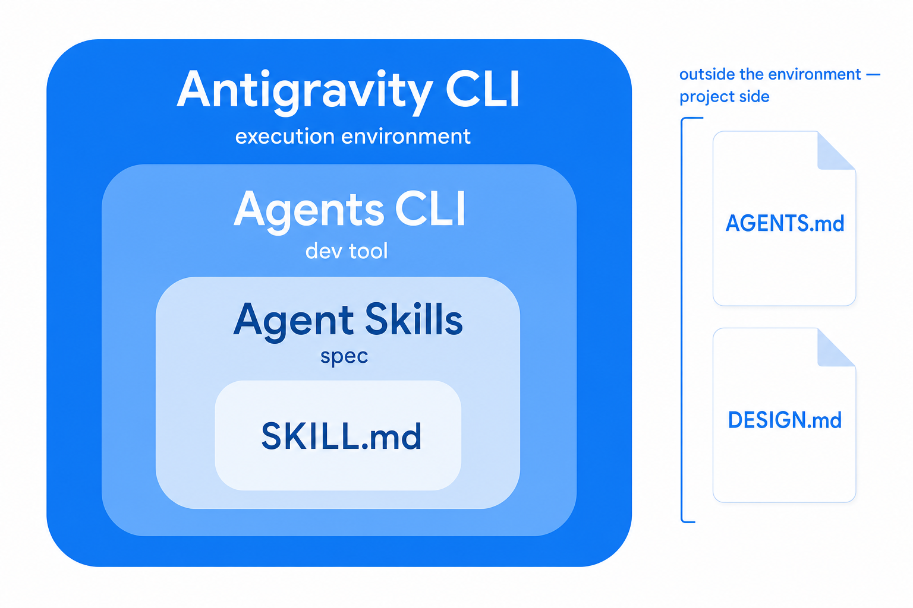
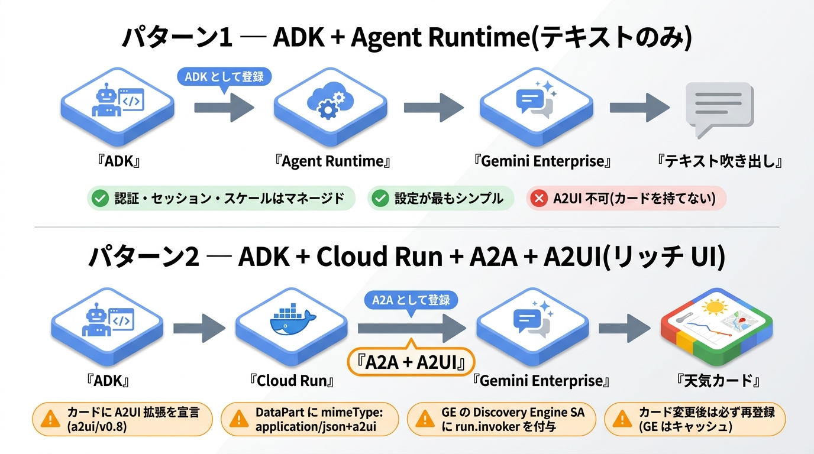

<!-- _class: title -->
<!-- _paginate: false -->

# Google のツールで作る<br>AI エージェント入門

## Gemini API の使い方から、ビルド・デプロイ・運用まで
ハッカソン参加者のためのクイックツアー

**Kimihiko Kitase**, Google Cloud

@kkitase (Facebook, Twitter, Github)


Findy ハッカソン 2026

---

# 今日のゴールと地図

ハッカソンで Gemini を使って何かを作り、動かす。そこまでの全体像を 5 つのパートでつかみます。

| パート | テーマ | キーワード |
|---|---|---|
| **1** | Gemini API の使い方と種類 | ダイレクト・Agent Platform・Interactions API |
| **2** | ビルド方法 | AGENTS.md・Agent Skills・Agents CLI・Antigravity |
| **3** | Google の MCP でつなぐ | 公式 MCP・BigQuery・Maps・Workspace |
| **4** | デプロイ先と登録 | Agent Runtime・Cloud Run・Gemini Enterprise |
| **5** | デプロイ後の管理 | 観測・評価・更新 |

> 迷ったら、まず動かして、必要になったら本格運用へ。この順番がいちばんの近道です。

---

<!-- _class: section -->

<span class="num">PART 1</span>

# Gemini API の使い方と種類

<p>同じ Gemini モデルへの入口を理解する</p>

---

# どう繋ぐか ── 認証の軸

Gemini API の選び方は 2 段階で考えると迷いません。まずは入口、**どう繋ぐか（認証）** から。どちらも同じ Gemini モデルに届き、違うのは認証・請求・周辺機能だけです。

| | ダイレクト | Agent Platform 経由 |
|---|---|---|
| 提供元 | Google AI Studio | Google Cloud プロジェクト上 |
| 認証方法 | **API キー** | **IAM（ロール・サービスアカウント付与）** |
| メリット | シンプルで即動作、設定がほぼ不要 | 堅牢なセキュリティ、詳細な監査、強固な権限分離 |
| デメリット | キー漏洩時の影響範囲が広い、監査ログが弱い | IAM 設定や初期の権限設計に手間がかかる |

> まずは Google AI Studio の API キーで始め、本番運用やセキュアな企業システムが必要になったら Agent Platform（Google Cloud）に移行するのが最もスマートな選び方です。

---


# ダイレクトも、使い込むと裏は Google Cloud

「ダイレクト方式だから Google Cloud は使わない」というのは誤解です。

無料枠（無料 Tier）を超えて本格的に使い込むと、実体は Google Cloud に紐づきます。

```text
無料 Tier → 課金をセットアップ → Google Cloud の課金アカウントに計上 → Tier 1 有効化
```

- **同じ基盤、請求だけの違い** ── 同じ Gemini モデルにアクセスしており、違うのは認証方式（APIキーかIAMか）と、請求の合算先だけです。
- **データプライバシー** ── 無料枠では入力が学習に利用される可能性がありますが、有料化（課金アカウントの紐づけ）もしくは Agent Platform 経由にすることで、データはモデルの学習から確実に保護されます。

> 無料枠を超えればどちらも結局 Google Cloud の課金に行き着くため、ハッカソンのうちは API キーで迷わずスタートして問題ありません。

---

# まずはここから generateContent

繋ぎ方が決まったら、次は **何を呼ぶか（メソッド）** の軸です。まずは、同じ Gemini に最も枯れた形でアクセスする標準、generateContent から見ていきます。

- **止められない本番向き** ── 正式提供(GA)されており、後方互換が保証されます。
- **ステートレス** ── 会話履歴は保持されないため、毎回すべての履歴を自分で送る必要があります。
- **本番機能がフル装備** ── Batch API、明示的キャッシュ、Context Caching、Function Calling などが全て安定して使えます。

> 落ちては困る本番運用や、シンプルな一問一答には、この generateContent が最も信頼できる選択肢です。

---

<!-- _footer: "" -->

# 例：一般的な API の使い方（ダイレクト）

Google AI Studio で API キーを即座に発行し、数行のコードを記述するだけで Gemini の頭脳を呼び出せます。

- **手軽さ重視** ── 面倒なインフラ設計や権限設定なしで、1分でプロトタイプが動きます。
- **コードでの呼び出し例** ── 新しい SDK（`google-genai`）での最も王道な使い方：

```python
from google import genai

# クライアント初期化（環境変数 GEMINI_API_KEY を自動参照）
client = genai.Client()

# generate_content で呼び出し
response = client.models.generate_content(
    model="gemini-3.5-flash",
    contents="AIエージェント開発の第一歩を教えてください。"
)
print(response.text)
```

> ハッカソンでは、この「ダイレクト × generateContent」の組み合わせがいちばんの近道です。

---

# 次世代の標準 Interactions API

もう一方のメソッドが、この Interactions API です。エージェント的な複雑なワークフローや、サーバー側での高度な状態管理に最適化された、これからの新しい標準です。

- **サーバー側での状態管理** ── `previous_interaction_id` で履歴を自動で継続。毎回すべての会話履歴を送信するコンテキスト負荷と費用を節約します。
- **観測可能な実行ステップ** ── モデルの「思考（Think）」「ツール呼び出し」「実行結果」がすべて型付きのステップで取得でき、デバッグやトレースが極めて容易です。
- **非同期の長時間タスク** ── 数分かかる重いリサーチやエージェント処理を `background=true` でサーバー側にオフロードできます。

> まだ Beta 仕様のため破壊的変更が入る可能性がありますが、新モデルや最新のエージェント機能はここに次々と登場します。

---

# 例：新しい使い方 Deep Research を API から

Interactions API の強力なサーバー側状態管理と非同期処理を活かした、最先端の自律型リサーチ機能です。 <span class="tag">Preview</span>

- **非同期実行が必須** ── ネット検索や計画策定に数分かかるため、`background=true` で投げ、結果をポーリングやストリーミングで受け取ります。
- **選べる 2 つのモデル**
  - `deep-research-preview-04-2026` ── 速度と効率を重視。ユーザーへのレスポンス速度が必要なUI向きです。
  - `deep-research-max-preview-04-2026` ── 網羅性と精度を最大化。長時間かけて精緻なレポートを作る用途向きです。
- **自律的な連携** ── 計画のレビュー、データの可視化、各種 MCP ツールとの自動連携を内蔵しています。

> ※Preview版のため、機密情報の入力は避け、生成されたレポートは下書きとして人が必ず確認するプロセスを入れてください。


---

# 2 つの軸を掛け合わせる

ここまで見てきた **認証**（どう繋ぐか）と **メソッド**（何を呼ぶか）は、独立した 2 つの軸です。「ダイレクトか generateContent か」の二択ではなく、縦と横でそれぞれ選びます。

| | generateContent<br>安定・単発の守り | Interactions API<br>エージェント・新機能の攻め |
|---|---|---|
| **ダイレクト**（API キー） | **① 個人開発・ハッカソンの王道** | **② 手軽に最先端エージェントを試す** |
| **Agent Platform**（IAM） | **③ 企業の安定した本番運用** | **④ セキュアな企業向けエージェント基盤** |

- **コード上の表現** ── `genai.Client(api_key=...)`（認証）と `.models.generate_content()` または `.interactions.create()`（メソッド）を自由に組み合わせるだけです。
- **ステップアップ** ── ①からスタートし、エージェント機能を試したければキーはそのままに②へ。本番セキュア化が必要なら③や④へ移行します。

---

<!-- _class: section -->

<span class="num">PART 2</span>

# ビルド方法

<p>AI エージェント時代の 4 つのキーワードを整理する</p>

---

# 似た名前の 4 つをレイヤーで整理

名前が似ていて混乱しがちな 4 つを、役割のレイヤーごとに並べました。

| # | 名前 | 種別 | ひとことで言うと |
|---|---|---|---|
| 1 | **AGENTS.md** | オープン標準 | プロジェクトの README のような説明書 |
| 2 | **Agent Skills** | オープン標準 | 作業ノウハウを詰めた再利用パック |
| 3 | **Agents CLI** | 開発ツール | Google Cloud にエージェントを作って出す CLI |
| 4 | **Antigravity CLI** | ツール本体 | ターミナル型エージェント（`agy`） |

> 競合製品ではなく、役割が積み重なっているのが大事なところです。

---

# ① AGENTS.md ── プロジェクトの「説明書」

Google や OpenAI、Cursor などの AI 企業が共同で立ち上げた**オープン標準**の指示ファイルです。

- **指示の集約** ── ツールや環境ごとに散らばりがちだったプロンプトやシステム指示を一本化します。
- **エージェントに自律性を与える** ── プロジェクトの概要、ビルド・テスト規約、コーディングルール、実行手順などを記述し、リポジトリのルートに置くだけでエージェントが自動で読み込みます。
- **急速な普及** ── すでに 2 万以上のオープンソースリポジトリ（OSS）で採用されています。
- **人間と AI の架け橋** ── 人間が読んでも一目で構成がわかり、AI エージェントが自律的にタスクを完了するための強固な土台となります。

> AI エージェントに「このプロジェクトはどう動かすべきか」を正しく教えるための共通仕様です。

---

# ② Agent Skills ＆ ③ Agents CLI ── 「ノウハウ」と「デプロイ」

<div class="cols">
<div class="col">

### ② Agent Skills（ノウハウ）
Anthropic が提唱する、特定作業のやり方をまとめた**オープン標準**の再利用可能なパックです。

- **ノウハウのパッケージ化** ── `SKILL.md` を中心に、必要なツールやスクリプトを 1 つのフォルダに同梱。
- **Progressive Disclosure** ── 必要な時にだけ読み込むため、LLM のコンテキスト消費と費用を最小限に抑えます。

</div>
<div class="col">

### ③ Agents CLI（デプロイツール）
エージェントを「作って、Google Cloud にデプロイし、Gemini Enterprise に配布・登録する」ための Google 公式 CLI です。

- **実体は Skills の束** ── 7 つの Agent Skills と、それらを呼び出すコマンド体系で構成されています。
- **デプロイの自動化** ── `infra` で IaC 構築、`deploy` で Cloud Run/GKE 出荷、`publish` で配布登録までを一気通貫で自動化します。

</div>
</div>

> 「Skills（特定ノウハウの規格）」を束ねて、実務のデプロイや配布を劇的にラクにするのが「Agents CLI」です。

---

# ④ Antigravity CLI ── 開発を加速する相棒・実行環境

Gemini CLI の後継として開発された、Go 製の強力なターミナル型エージェント（TUI）です。コマンドは `agy` を使用します。

- **超自律的なコーディング** ── 複数ステップの推論、複数ファイルの同時編集、自律的なツール実行をエージェント自身で完結。
- **マルチモデル対応** ── Gemini モデルを中心に最適化されつつ、Claude などの他モデルも選択可能。
- **フルスタックの機能継承** ── Agent Skills、Hooks、Subagents などをそのままロードして実行できます。

> 役割は対照的です。**Antigravity** は「あなたの開発（コーディング）を手伝う」実行環境、**Agents CLI** は「作ったエージェントの出荷」を助けるツールです。

---

# 入れ子関係と実務の組み合わせ

4 つの関係を図にすると入れ子になります。実務では 2 通りの組み合わせが定番です。

<div class="cols">
<div class="col">



</div>
<div class="col">

### A. コーディングを手伝わせたい
1. 実行環境を選ぶ（Antigravity・Claude Code）
2. `AGENTS.md` を置く
3. 繰り返す作業は Agent Skills 化
4. Agents CLI は基本不要

### B. エージェントを作ってデプロイ
1. `uvx google-agents-cli` を導入
2. 好きなエージェントから叩く
3. infra → deploy → publish

</div>
</div>

---

# DESIGN.md ── 見た目を AI に伝える標準

AGENTS.md が「どう動くか」なら、DESIGN.md は作るものが **「どう見えるか」**。色・フォント・余白を、**AI エージェントが読める 1 ファイル**にするオープン仕様です（Google Labs の Stitch 由来、2026 年 4 月に alpha 公開）。

<div class="cols">
<div class="col">

### 何を（YAML トークン）
機械がそのまま当てはめる「正解の値」。

```yaml
color:
  primary: "#1A73E8"
font:
  display: "Google Sans"
  body: "Noto Sans JP"
radius: { md: "8px" }
```

</div>
<div class="col">

### なぜ（Markdown 根拠）
トークンで表せない判断のよりどころ。

- ブランドの性格（信頼できる・親しみやすい）
- アクセシビリティ（本文は WCAG AA）
- 47 ページの PDF は誰も開かない。1 ファイルなら **Claude Code・Cursor・Copilot** が同じ定義を参照

</div>
</div>

> リポジトリのルートに置くだけで、どのツールで作っても見た目が揃います。実はこのスライドも、Google Cloud の DESIGN.md に沿って作りました。

---

<!-- _class: section -->

<span class="num">PART 3</span>

# Google の MCP でつなぐ

<p>エージェントに Google のデータとツールを手として持たせる</p>

---

# MCP とは？ なぜ Google 公式が効くのか

**MCP（Model Context Protocol）** は、エージェントが外部のツールやデータに標準のやり方でつなぐための共通規格です。Part 1 の Interactions API でも、MCP 連携として登場しました。

- 自前で API 連携を書く代わりに、**MCP サーバーを挿すだけ**でツールが増える
- Google は公式ハブ **`github.com/google/mcp`** で MCP サーバー群を提供
- だから Gemini エージェントに **BigQuery・Firestore・Maps・Workspace** などを最短でつなげる

> ハッカソンの勝ち筋は、データ連携を自作しないことです。公式 MCP を挿して、自分のロジックに集中しましょう。

---

# Google 公式 MCP のラインナップ

公式ハブには、Google マネージドのリモート MCP と、オープンソースの MCP が揃っています。

<div class="cols">
<div class="col">

### リモート（Google マネージド）
- データ系は BigQuery・Firestore・Spanner・Cloud SQL・Bigtable・AlloyDB・MCP Toolbox for Database
- 基盤系は Cloud Run・Google Kubernetes Engine (GKE)・Compute Engine・Cloud Storage
- そのほか Google Maps（Grounding）や Security Operations

</div>
<div class="col">

### オープンソース
- Workspace の Docs・Sheets・Slides・Calendar・Gmail
- Firebase・Google Analytics・gcloud CLI・Developer Knowledge MCP
- Cloud Observability・Chrome DevTools・Flutter

</div>
</div>

> 自分の MCP サーバーも 10 分かからずに作って、Cloud Run・GKE・Apigee にデプロイできます。ADK に Maps と BigQuery をつないだサンプルも公開されています。

---

<!-- _class: section -->

<span class="num">PART 4</span>

# デプロイ先と登録

<p>どこに置くか、どう Gemini Enterprise に載せるか</p>

---

# Agent Platform の全体像 — Build・Scale・Govern・Optimize

デプロイ先の比較に入る前に、土台を一望します。Gemini Enterprise Agent Platform は、エージェントの一生を 4 つのステージでまるごと支えます。

| ステージ | やること | 主なコンポーネント |
|---|---|---|
| **Build** | 作る | ADK・Agent Studio・Agent Garden・Model Garden |
| **Scale** | 動かす | Agent Runtime・Sessions・Memory Bank・Sandbox |
| **Govern** | 統制する | Agent Identity・Agent Gateway・Agent Registry |
| **Optimize** | 改善する | Evaluation・Observability・Simulation |

> 今日のメインは Build と Scale です。残りの Govern と Optimize は、本番に乗せるときに効いてきます（後半の付録で触れます）。

---

# 抽象度が異なる 3 つの選択肢

エージェントの置き場所は、抽象度の高い順に 3 つあります。

| 観点 | Managed Agents API | Agent Runtime | Cloud Run |
|---|---|---|---|
| 抽象度 | **高**（API で使うだけ） | **中**（自作コードを持ち込む） | **低**（汎用・DIY） |
| デプロイ対象 | コード不要・API 操作 | Python のエージェント | 任意言語のコンテナ |
| 運用責任 | ほぼ Google 任せ | インフラは Google | スケールも自分 |

- **Agent Runtime（Agent Engine）** — ADK や LangGraph などを動かすフルマネージド実行環境（デプロイは Python）
- **Cloud Run** — 任意のコンテナを動かせる汎用サーバーレス。ゼロまでスケールし、課金は実行時間だけ

> Agent Runtime は、Cloud Run 系インフラの上に建つ上位レイヤーという関係です。

---

# Gemini Enterprise への登録で素直なのはどっち？

どちらでもホストできますが、登録の素直さに差が出ます。ADK で作った Agent Engine なら、**Agent2Agent プロトコル (A2A)** の実装なしで登録できます。

| | Agent Runtime（Agent Engine） | Cloud Run |
|---|---|---|
| 登録経路 | **ネイティブ登録** か A2A | **A2A 登録のみ** |
| A2A 実装 | 不要（ADK ネイティブなら） | 必須 |
| UI | テキスト | A2UI を利用可能 |
| 認可設定 | マネージド寄り | 自前（`Cloud Run Invoker` 付与など） |

- **ADK と Agent Engine** の組み合わせが最も素直で、ADK エージェントをそのまま登録できる
- **Cloud Run** はただの REST では登録できず、A2A の Agent Card 実装が必要（`to_a2a()` で軽減可）

> 開発者として始めるのは簡単です。Google Cloud にサインインし（新規は $300 分のクレジット）、プロジェクトを作って API を有効化するだけ。Express モードの API キーなら、IAM 付与もスキップできます。

---

# A2UI ── エージェントが UI を返す（Generative UI）

A2A がエージェント同士をつなぐなら、**A2UI はエージェントとユーザーをつなぐ**プロトコルです。テキストだけでなく、**カードやフォーム、ボタンといった UI を宣言的に返し**、クライアントがそのまま描画します。

<div class="cols">
<div class="col">

### しくみ
- エージェントが **UI を JSON Lines でストリーム**配信
- クライアントは受け取った定義を**そのまま描画**
- 「文章で説明」から「操作できる画面を返す」へ

</div>
<div class="col">

### いま
- **v0.8 Public Preview**、Apache 2 のオープン仕様
- Linux Foundation への寄贈が見込まれる
- 合言葉は **Generative UI is the new frontend**

</div>
</div>

> チャットの先へ。エージェントの答えが、読むものから **触れるもの** に変わります。

---

<!-- _footer: "" -->

# 例：お天気エージェント

その A2UI を、お天気エージェントで具体的に見てみます。テキストだけの素直なパターンと、A2A + A2UI でリッチな UI（天気カード）を返すパターンの比較です。

<div style="text-align:center">



</div>

---

<!-- _class: section -->

<span class="num">PART 5</span>

# デプロイ後の管理

<p>動かした後に何を見て、どう更新するか</p>

---

# デプロイ後に押さえる 4 つの観点

動かして終わりではありません。見るべきものと、更新の仕方を押さえておきます。

<div class="cols">
<div class="col">

### 観測（Observability）
- 実行ステップや思考、ツール呼び出しをトレース
- Cloud Trace やログで失敗箇所を特定
- Interactions API は型付きステップで中間を見やすい

### 評価（Eval）
- 評価セットで品質を継続チェック
- 直して再評価のループを回す

</div>
<div class="col">

### スケールとセキュリティ
- Agent Runtime はインスタンス数・メモリ・同時実行を制御
- VPC-SC や IAM 認証を内蔵

### 更新と配布
- コードを直して再 `deploy`
- `publish gemini-enterprise` で再登録・共有

</div>
</div>

> マネージドな Agent Runtime ほど運用は Google 任せ、自由度の高い Cloud Run ほど自前の管理が増えます。

---

# ハッカソンのおすすめルート

1. **入口** — Google AI Studio の **API キー（ダイレクト）** で即スタート
2. **ビルド** — 実行環境（Antigravity・Claude Code）と `AGENTS.md`、Agent Skills
3. **つなぐ** — Google 公式 **MCP** で BigQuery・Maps・Workspace を挿す
4. **作って出す** — `uvx google-agents-cli` で infra から deploy、publish まで
5. **デプロイ先** — 素直さ重視なら **ADK と Agent Engine**、自由度なら Cloud Run
6. **管理** — トレース・評価・再 publish で回す

> 合言葉は「まず動かす、必要になったら本格運用へ」。同じ Gemini への入口を選んで、足りない手は MCP で足すだけです。

---

<!-- _class: title -->
<!-- _paginate: false -->

# ありがとうございました

## さあ、Gemini で作って動かしましょう

Findy ハッカソン 2026

---

<!-- _class: section -->

<span class="num">APPENDIX</span>

# もっと深く：本番運用のヒント

<p>ハッカソンの先、本番に乗せるときに効く話</p>

---

# 本番のコスト & スループット設計

無料枠やレート制限とうまく付き合うための、Google Cloud 側の仕組みです。

<div class="cols">
<div class="col">

### コストを下げる
- **Context Caching** — 長い前提（32K トークン以上）を使い回し、入力コストを最大 75% 削減
- **Dynamic Shared Quota** — 地域内で容量を公平に配り、急なスロットリングを避ける

</div>
<div class="col">

### 安定して捌く
- **Provisioned Throughput** — ベースの負荷に予約枠で安定容量を確保
- **従量課金・Flex・Batch** — 突発分や急がない処理を使い分け
- **Cascade Router** — 安いモデルから試し、足りなければ上位へ

</div>
</div>

> まず安いモデルと従量課金で始め、安定が必要になったら予約型へ。限られた予算でも効く考え方です。

---

# 本番に乗せる — Scale と Govern

作ったエージェントを安全にスケールさせる部品が揃っています。

<div class="cols">
<div class="col">

### Scale（動かす）
- **Agent Runtime** — 起動 1 秒未満・最長 7 日のステートフル実行。独自コンテナ持ち込み可、Python・Java・TypeScript・Go 対応
- **Agent Sandbox** — 隔離環境でコードやツールを安全に実行
- **Sessions・Memory Bank** — 短期の会話と長期の記憶を管理

</div>
<div class="col">

### Govern（統制する）
- **Agent Identity** — エージェントごとに最小権限の身元を自動付与
- **Agent Gateway** — 全トラフィックを一点に集約し、認証と検査を通す
- **Model Armor** — プロンプト インジェクションなどを入口で防ぐ

</div>
</div>

> セキュリティや観測の負担を、開発者からプラットフォーム側へ寄せる。これが本番をラクにする勘どころです。

---

# ツール設計と RAG の勘どころ

エージェントの賢さは、ツールの設計とデータの渡し方で決まります。

<div class="cols">
<div class="col">

### ツール設計のコツ
- **タスク単位で公開** — 薄い API ラッパーにしない
- **名前と説明は人が読んでわかる形に**
- **1 ツール 1 機能** — 何でも屋を避ける
- **出力は簡潔に** — 巨大な結果は外部に置き、参照を渡す
- **スキーマ検証と、直し方がわかるエラー文**

</div>
<div class="col">

### RAG（検索拡張生成）の型
- **取り込みと検索を分ける** — 取り込みは非同期、検索はリアルタイム
- 保存 → チャンク化 → 埋め込み → Vector Search で引く
- 複雑な関係をたどるなら **GraphRAG**（Spanner）
- 観測は **OpenTelemetry** の GenAI 規約で統一

</div>
</div>

> ツールとデータを丁寧に設計すると、同じモデルでも体感の精度が上がります。

---

<!-- _class: title -->
<!-- _paginate: false -->

# さあ、作りにいこう

## Google のツールで、アイデアを動かそう

Findy ハッカソン 2026
